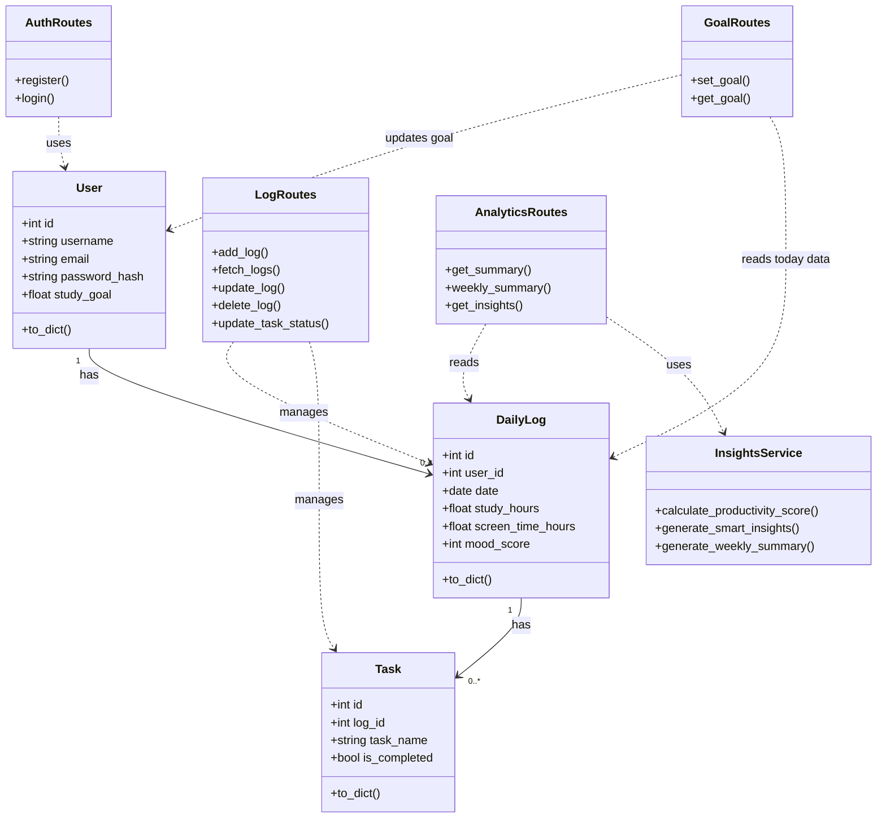
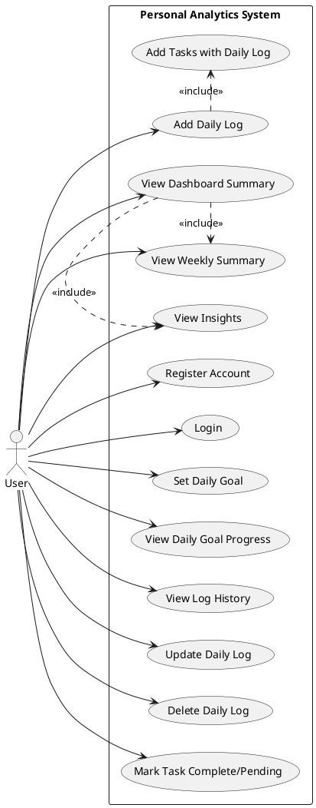
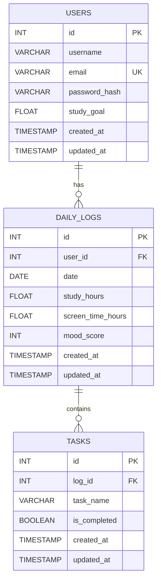

# Personal Data Analysis UML

## Class Diagram (Mermaid)

## Use Case Diagram (PlantUML)

## ER Diagram (Mermaid)

## Endpoint Mapping (Quick Reference)
- Register: `POST /api/auth/register`
- Login: `POST /api/auth/login`
- Add log: `POST /api/logs/add`
- Fetch logs: `GET /api/logs/fetch?user_id=...`
- Update log: `PUT /api/logs/update/<log_id>`
- Delete log: `DELETE /api/logs/delete/<log_id>?user_id=...`
- Update task status: `PUT /api/logs/<log_id>/tasks/<task_id>/status`
- Dashboard summary: `GET /api/analytics/summary?user_id=...`
- Weekly summary: `GET /api/analytics/weekly-summary?user_id=...`
- Insights: `GET /api/analytics/insights?user_id=...`
- Set goal: `POST /api/goals/set`
- Get goal: `GET /api/goals/get?user_id=...`

